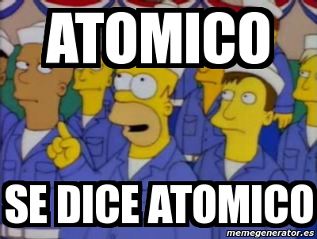
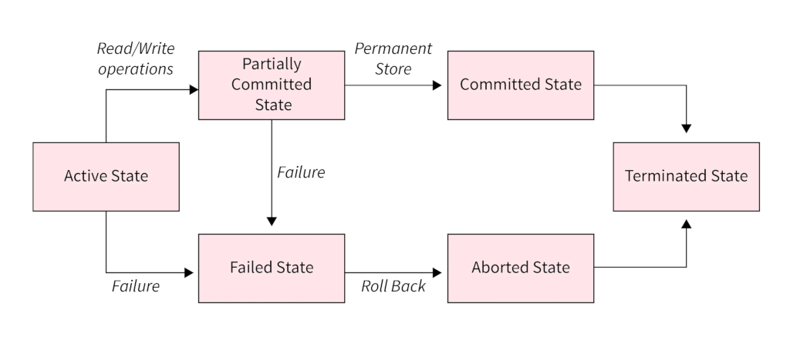

# Concurrencia

__Múltiples tareas compiten por el acceso al mismo recurso__

# ¿Qué son las transacciones?

**Unidades atómicas de trabajo**

# Dónde y para qué se usan

* Aplicaciones bancarias
* Sistemas de control de stock
* Sistemas de archivos: journaling
* IoT: sistemas de iluminación
* __??????__

# Qué hacen

* Garantizan consistencia e integridad de datos
* Garantizan el aislamiento de una unidad de trabajo
* Protegen ante fallas físicas y de software

 
# Cómo lo hacen

* Proveen distintos niveles de aislamiento
* Permiten cancelar una operación en progreso sin side effects
* Bloquean registros modificados

# Bloqueo de registros

* __Bloqueo pesimista__: fuerza a que otras transacciones que quieran acceder a un registro tengan que esperar
* __Bloqueo optimista__: permite que otras transacciones ignoren los registros bloqueados

# Referencias

* [Database Transactions - Wikipedia](https://en.wikipedia.org/wiki/Database_transaction)
* [ACID properties - Wikipedia](https://en.wikipedia.org/wiki/ACID)
* [Postgres Concurrency Control](https://www.postgresql.org/docs/current/mvcc.html)
* [Java Concurrency In Practice - Brian Goetz et al.](https://libgen.li/ads.php?md5=26544cc9a44791828d3c53cd03c07c35)

